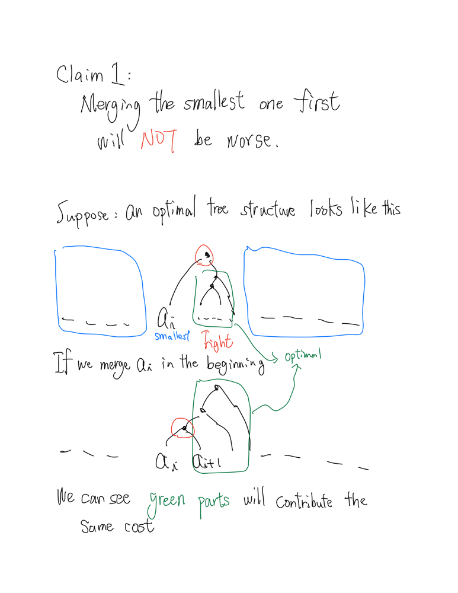
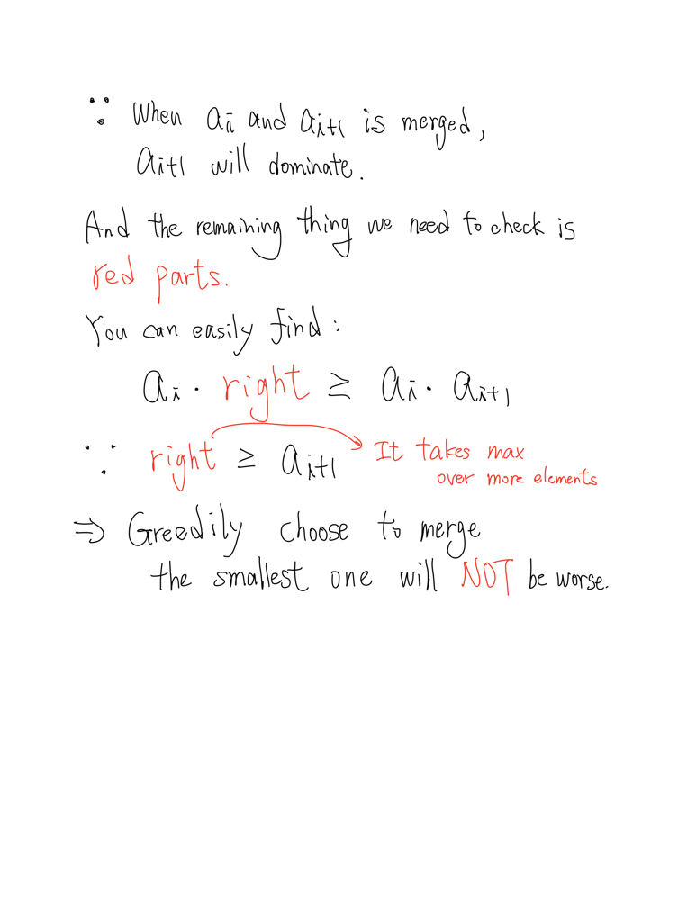
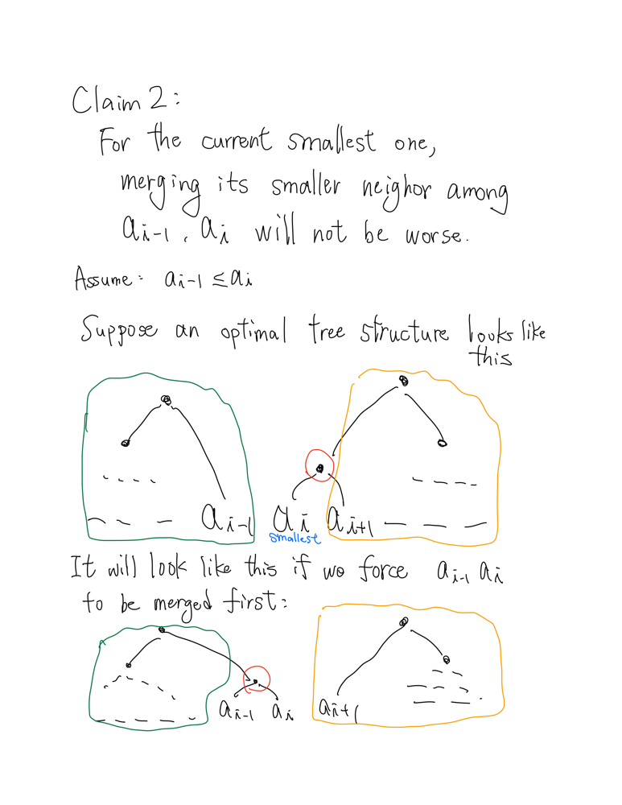
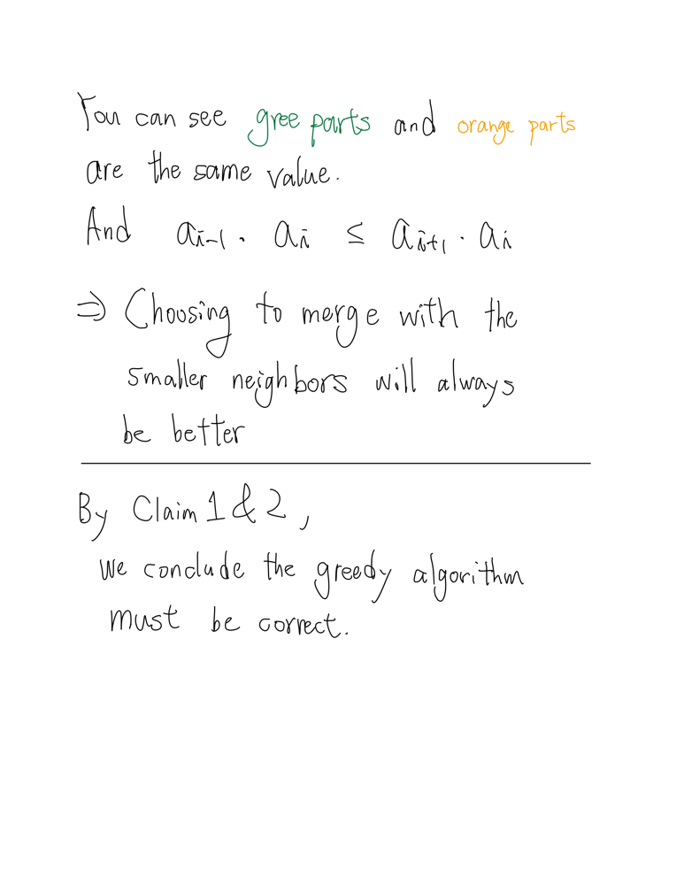
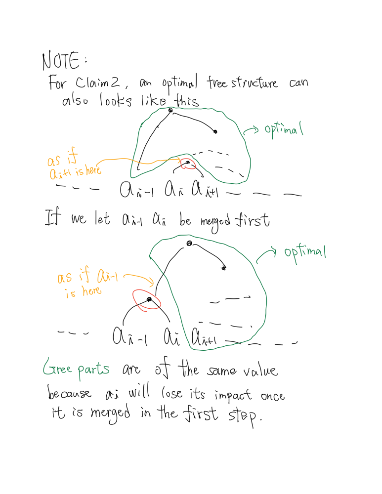
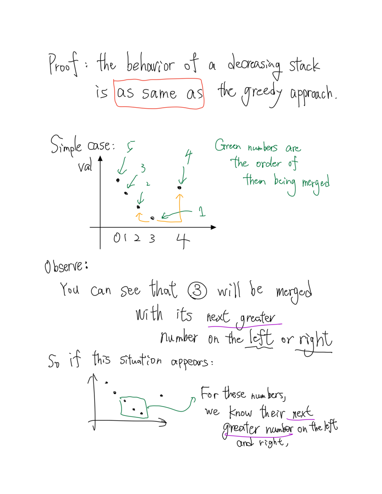

| No. | LC-#     | Title	                                                                                                                                                                                | Time                    | Space                 | Difficulty | Data_Structure   | Algorithm                    | Premium    |
| --- | -------- | ---------------------------------------------------------------------------------------------------------------------------------------------------------------------------------------- | ----------------------- | --------------------- | ---------- | ---------------- | ---------------------------- | ---------- |
| 1   | 53       | [Maximum Subarray](https://leetcode.com/problems/maximum-subarrays/) [Solution](https://github.com/sm2774us/competitive_programming_book/blob/master/arrays/maximum_subarray.py)                 | _O(N)_                  | _O(1)_                | Medium     | Array            | Kadane's Algorithm           |            |
| 2   |          | _**Maximum Subarray - Variant**_ [Solution](https://github.com/sm2774us/competitive_programming_book/blob/master/arrays/maximum_subarray_variant.py)                                             | _O(N)_                  | _O(1)_                | Medium     | Array            | Kadane's Algorithm           | 🔒         |
| 3   | 1130     | [Minimum Cost Tree From Leaf Values](https://leetcode.com/problems/minimum-cost-tree-from-leaf-values/) [Solution](https://github.com/sm2774us/competitive_programming_book/blob/master/monotonous_stacks/minimum_cost_tree_from_leaf_values.py)  | _O(N)_ | _O(N)_ | Medium    | Monotonous Stack | Greedy            |            |
|     |          |  | | | | | | |
|     |          |  | | | | | | |
|     |          |  | | | | | | |
|     |          |  | | | | | | |
|     |          |  | | | | | | |